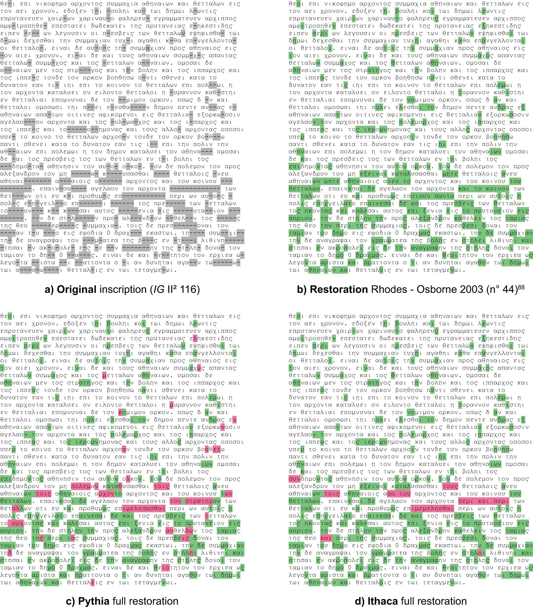

+++
date = '2025-04-11T11:07:47-04:00'
draft =  false
title = 'The Pythia and Ithaca tools'
+++

The [Pythia](https://doi.org/10.18653/v1/D19-1668) and [Ithaca](https://doi.org/10.1038/s41586-022-04448-z) papers, by Assael et al., describe deep learning approaches to deciphering epigraphic data.

<!--more-->

I want to focus on the _methods_ used in the papers, partly because the details matter, and can help direct my own research. Because the Pythia paper is more recent, I will focus on it.

Ithaca attempts to predict three different things at once: text restorations, approximate text age, and approximate location. It is a "deep learning" attentional/transformer pipeline.

## Preprocessing

The Pythia system uses the Packard Humanities Institute (PHI) [corpus of Greek epigraphic data](https://inscriptions.packhum.org/). The researchers do the following normalization:

1. Remove all diacritics and case-normalize (convert to lowercase)
2. Use reconstructed letters as present in the corpus
3. Use - for still unknown letters -- although it looks more like they space separate the unknown characters.
4. Seem to remove some characters (like `:` ? in the example below)

They do _not_ regularize sigmas to (say) lunate sigma`ϲ`, but use both `σ` and `ς`.

Example [Raw and processed inscription](https://www.nature.com/articles/s41586-022-04448-z/figures/4) copied from the Ithaca paper:

_Figure 4, Reconstructed epigraph_

Only common words (appearing 10 or more times in the PHI database) are used as vocabulary; the rest, as well as damaged, words are marked as the single token `[unk]`. Each sentence is also padded with a start-of-sentence character (`<`).

Because (compared to other large language tasks) there is a paucity of Ancient Greek epigraphy data, the PHI data was "augmented" in several ways, including text clipping, text masking, word deletion, and sentence swapping. Text clipping subselects portions of the text; text masking randomly hides "up to half" of the text; word deletion randomly removes some words; sentence swapping randomly swaps sentences.

Ithaca "was trained for a week on 128 Tensor Processing Units (TPU) v4 pods on the Google Cloud Platform." In April, 2025, this would represent a cost of $70,000 at [current](https://web.archive.org/web/20250415133754/https://cloud.google.com/tpu/pricing?hl=en) non-discounted cost; at 7.4 Kwh of consumption[^1], this is about 160,000 Kwh, or approximately what it takes to power an average US house for 15 years[^2].

For prediction of text restorations, they selected a "sequence of missing characters" to predict in the evaluation set. Text restoration on a non-randomly sampled example is provided in the [Data figure 4](https://www.nature.com/articles/s41586-022-04448-z/figures/7), and suggests that Ithaca's restoration was more accurate than Pythia's, when compared to the "Rhodes-Osborne edition." Although they do not note that this is a non-random sample, they do note that in the context of a tool, the suggested restorations would be provided as sets of answers, not just the most probable one. Unsurprisingly, the longer the lacuna, the less likely it was for Ithaca and Pythia to correctly guess the correct reconstruction.

_Data Figure 4, Restoration performance comparison_

For evaluation, they provide both a _character error rate_ (CER) and _accuracy_ score, with CER scores calculated for each text restoration sequence length (up to 10), and then averaging these CERs (which seems a bit dodgy?)

| Method         | Restoration Average CER (%) | Top 1% Accuracy | Top 20% |
| -------------- | --------------------------- | --------------- | ------- |
| Human + Ithaca | **18.3**                    | **71.7**        | -       |
| Human          | 59.6                        | 25.3            | -       |
| Ithaca         | 26.3                        | 61.8            | 78.3    |
| Pythia         | 47.0                        | 32.6            | 53.9    |

_Experimental results. CER: lower is better. Average: higher is better._

Note that these results are based on randomly creating lacunae in the text, and restoring them. What I find evocative is the large improvement in AI-assisted restoration compared to either human alone or AI alone.

## Summary

The authors provide an [on-line tool](https://predictingthepast.com/) to do limited text restoration of epigraphs, allowing up to ten characters to be restored, requiring a text of between 50 and around 736 characters. It's fairly hard to use, but not impossible; it's more limited by the character length and total number of restorations possible.

I did two quick attempts at restoration. One was some text from the Packard Humanities Institute ([BCH 8 (1884) 470,1)](https://inscriptions.packhum.org/text/234304?&bookid=118&location=1700), and the other from the text of the Gospel of John. The PHI text approximated the results in the table above (of course, it's a very small sample). For the John passage, I gave it [John 1:18-24](https://www.biblegateway.com/passage/?search=John%201%3A18-24&version=SBLGNT), leaving `Φαρισαίων` as a lacuna. Unsurprisingly, the tool does poorly for text restoartion, with its best guesses `γραμματων` and `πραγματων`. Not only is this non-epigraphic text, it is unlikely that `Φαρισαῖος` and its variants appear in the PHI corpus, and the contextual information will be very different. For what it's worth, the location and date attributes were off as well—again, unsurprisingly.

This paper does suggest to me that tools for text restoration can be helpful to researchers in conjunction with the researchers' own knowledge. But the tooling has to be built to integrate into a researcher's own workflow; and that training data and evaluation methods matter a great deals.

These are papers which are easy to use to suggest that text reconstruction, dating, and location are solved problems — not that the authors so suggest, but the popular science press. This has to be resisted; these papers are only a start towards incorporating AI assistance for the ordinary working epigrapher or papyrologist.

## Bibliography

1. Assael, Y., Sommerschield, Th, Prag, J., 2019. Restoring ancient text using deep learning:
   a case study on Greek epigraphy. In: Proceedings of the 2019 Conference on
   Empirical Methods in Natural Language Processing and the 9th International Joint
   Conference on Natural Language Processing. Hong Kong, China, November 3–7,
   Association for Computational Linguistics, Hong Kong, pp. 6368–6375.
   https://doi.org/10.18653/v1/D19-1668.

2. Assael, Y., Sommerschield, Th, Shillingford, B., Bordbar, M., Pavlopoulos, J.,
   Chatzipanagiotou, M., Androutsopoulos, I., Prag, J., de Freitas, N., 2020. Restoring
   and attributing ancient texts using deep neural networks. Nature 603, 280–283.
   https://doi.org/10.1038/s41586-022-04448-z.

## Footnotes

[^1]: [Power Consumption Comparison of TPU v4 and NVIDIA H100 GPUs](https://massedcompute.com/faq-answers/?question=What%20is%20the%20power%20consumption%20of%20TPU%20v4%20compared%20to%20NVIDIA%20H100%20GPUs?)
[^2]: [How many kWh does a house use?](https://www.constellation.com/energy-101/energy-education/average-home-power-usage.html)
